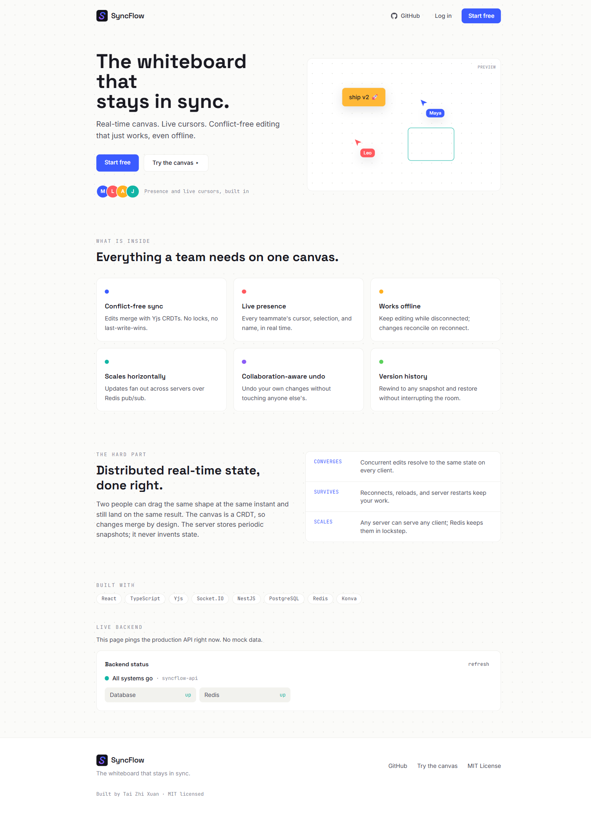
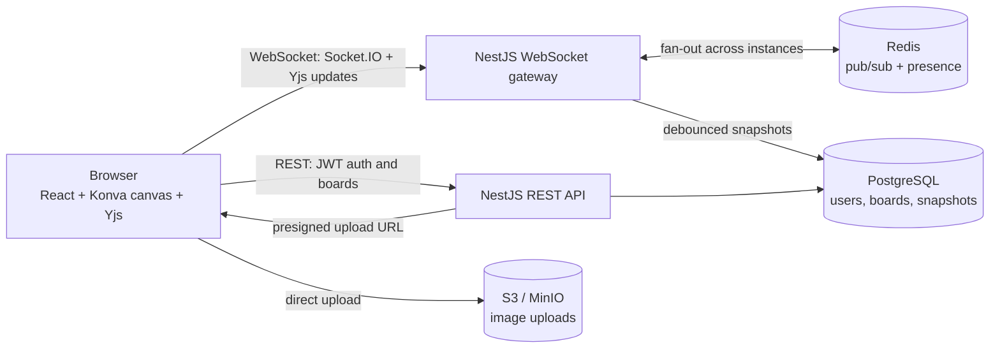

# SyncFlow

[](https://syncflows.xyz)
[](https://syncflows.xyz)
[](https://github.com/taizhixuan/SyncFlow/actions/workflows/ci.yml)
[](https://opensource.org/licenses/MIT)

SyncFlow is a multi-user, real-time collaborative whiteboard in the spirit of Miro and Excalidraw. A team shares one infinite canvas where you can draw shapes, add sticky notes, drop in images, and sketch freehand, and everyone sees each change as it happens. When two people edit at the same moment their changes merge automatically instead of overwriting one another, live presence shows who is working where, and your work survives dropped connections, tab reloads, and server restarts.

The interesting problem underneath is distributed real-time state: conflict-free concurrent editing, presence, offline reconciliation, and version history, all kept in sync across several server instances through Redis pub/sub.

## Tech stack

**Frontend**


**Backend**


**Infrastructure & deployment**


**Tooling & quality**


> `packages/shared` (TypeScript types and Zod schemas) is imported by both the client and the server, so every contract that crosses the network is defined exactly once.



## What makes it different

The hard part is keeping everyone's canvas consistent. Picture two people dragging the same shape at the same instant. There are no server-side locks and no "last write wins" surprises, because the canvas is a CRDT built on Yjs: a data structure that merges concurrent changes correctly by design. The server stores periodic snapshots for durability and never invents state of its own.

## Features

### Real-time collaboration
- **CRDT sync (Yjs).** Every board is a Yjs document that merges edits without conflicts. The server persists state rather than authoring it.
- **Scales across servers.** Updates fan out between API instances over Redis pub/sub, so an edit on one server reaches clients connected to another.
- **Presence and live cursors.** You can see where teammates are pointing, what they have selected, and who is online. This is ephemeral and never written to the database.
- **Offline editing.** Changes made while disconnected are kept locally in IndexedDB and merge cleanly once you reconnect.
- **Collaboration-aware undo.** You undo your own actions without touching anyone else's.
- **Version history.** Snapshots let you rewind and restore a board without disrupting people who are editing live.

### Rich canvas
- Shapes (rectangles, circles, diamonds, triangles, stars), sticky notes, text, freehand drawing, code blocks, and images, plus smart connectors that reroute themselves when shapes move.
- Markdown inside text boxes, link embeds with favicons and titles, frames for grouping content into sections or slides, and mind maps with auto-layout (press Tab to add a child).
- Multi-select, snap to grid, grouping, copy and paste, alignment and distribution, a dark mode that adjusts colors automatically, and an optional hand-drawn look.

### Built for teams
- **Comments** pinned to any element or point on the board, with inline replies and a resolved state.
- **Voting** with dot votes or emoji reactions, highlighting the top ideas.
- **Tags** for labelling, filtering, and grouping content.
- **Shared timer** and **laser pointer** for presentations and workshops.

### Workflows and exports
- **Templates** for retros, kanban, flowcharts, mind maps, and user-story maps.
- **Component library** to save a set of objects and reuse them as copies.
- **Presentation mode** that turns frames into slides others can follow.
- **Exports** to PNG, SVG, PDF, PDF with one frame per slide, and mind maps as Markdown outlines.
- **Minimap** with a viewport rectangle and click-to-pan.

### Platform essentials
- **Authentication** with JWT access tokens, rotating refresh tokens, and a revocation list.
- **Board management** to create, edit, delete, control who has access, and invite people by shareable link or email.
- **Image uploads** straight onto the canvas, stored on S3 in production and MinIO locally.

## Project structure

```
apps/
  web/              React + Vite client (organized by feature)
  api/              NestJS server (REST + WebSocket)
packages/
  shared/           Shared TypeScript types and Zod schemas
docker/             Container configs and nginx setup
docker-compose.yml  Local dev stack: postgres, redis, minio
.github/workflows/  Automated testing, linting, building, and deployment
render.yaml         Deployment blueprint for Render hosting
```

`packages/shared` is the single source of truth. Any type or schema that crosses the network boundary lives there, so the client and server import the same definition and stay in step.

## Get started locally

You need Docker with Docker Compose, Node 20 or newer, and pnpm 9 or newer.

```bash
# Install dependencies
pnpm install

# Copy dev config (defaults work fine locally)
cp .env.example .env

# Start the database, cache, and storage services
pnpm compose:up

# Set up the database schema
pnpm db:deploy

# Start the app (web and API)
pnpm dev
```

Then visit:
- **Canvas app:** http://localhost:5173
- **API:** http://localhost:3000/api/v1
- **API health check:** http://localhost:3000/api/v1/health/ready
- **MinIO storage console:** http://localhost:9001

> **Note:** Postgres runs on port 5433 instead of the default 5432 to avoid clashing with a local Postgres install. The connection string in `.env` is already set up for this.

### Full stack in containers

```bash
pnpm compose:full      # builds and runs api and web in Docker too (web on :8080)
```

## Testing

```bash
# Unit tests (frontend and backend)
pnpm test

# Set up an isolated test database (first time only)
pnpm db:test:deploy

# API end-to-end tests (auth, boards, invites, uploads, real sync through the gateway)
pnpm test:e2e
```

Tests cover the parts that matter: board CRUD and permissions, the auth flow, image uploads, and the trickiest case of two clients editing at once and converging to the same result through the real gateway, Postgres, and Redis.

## Deployment

**Live at [syncflows.xyz](https://syncflows.xyz).** Production runs across free tiers: the web app on Vercel, the API and Redis on Render (Docker), Postgres on Supabase, and image storage on AWS S3, with `api.syncflows.xyz` serving both REST and the WebSocket. Every push and pull request runs linting, type-checking, tests, and a build through GitHub Actions. 

## How it works



A few things worth calling out:

- The canvas is a Yjs document held in memory on the server, one per board, and mirrored across instances through Redis pub/sub. PostgreSQL keeps periodic snapshots for durability and version history.
- Ephemeral data such as cursors, selections, online status, and laser pointers travels over Yjs Awareness. It is broadcast to the room but never saved.
- To scale out you add more API servers. They all subscribe to the same Redis channels, so every client sees every change no matter which server it connects to.
- For images, the browser asks the API for a short-lived signed URL and uploads straight to S3 or MinIO, so image bytes never pass through the API server.

## License

This project is licensed under the MIT License. See the [LICENSE](LICENSE) file for details.
