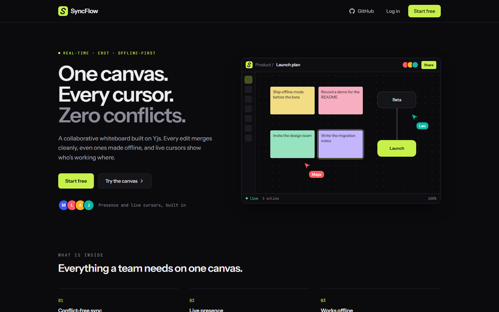
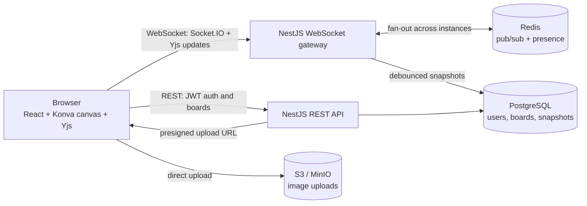

# SyncFlow

[](https://syncflows.xyz)
[](https://syncflows.xyz)
[](https://github.com/taizhixuan/SyncFlow/actions/workflows/ci.yml)
[](https://opensource.org/licenses/MIT)

SyncFlow is a multi-user, real-time collaborative whiteboard in the spirit of Miro and Excalidraw. A team shares one infinite canvas where you can draw shapes, add sticky notes, drop in images, and sketch freehand, and everyone sees each change as it happens. When two people edit at the same moment their changes merge automatically instead of overwriting one another, live presence shows who is working where, and your work survives dropped connections, tab reloads, and server restarts.

The interesting problem underneath is distributed real-time state: conflict-free concurrent editing, presence, offline reconciliation, and version history, all kept in sync across several server instances through Redis pub/sub.

## Tech stack

**Frontend**


**Backend**


**Infrastructure & deployment**


**Tooling & quality**


> `packages/shared` (TypeScript types and Zod schemas) is imported by both the client and the server, so every contract that crosses the network is defined exactly once.



## What makes it different

The hard part is keeping everyone's canvas consistent. Picture two people dragging the same shape at the same instant. There are no server-side locks and no "last write wins" surprises, because the canvas is a CRDT built on Yjs: a data structure that merges concurrent changes correctly by design. The server stores periodic snapshots for durability and never invents state of its own.

## Features

### Real-time collaboration
- **CRDT sync (Yjs).** Every board is a Yjs document that merges edits without conflicts. The server persists state rather than authoring it. Even votes, reactions, tags, and comment replies are stored per user and per item, so two people voting or replying at the same moment both count.
- **Scales across servers.** Updates fan out between API instances over Redis pub/sub, so an edit on one server reaches clients connected to another. If an instance loses Redis for a while, it reconciles every live board with the other instances when the connection returns.
- **Presence and live cursors.** You can see where teammates are pointing, what they have selected, and who is online. This is ephemeral and never written to the database, and the server checks every cursor update so nobody can draw a cursor under someone else's name.
- **Offline editing.** Changes made while disconnected are kept locally in IndexedDB and merge cleanly once you reconnect. The client follows the browser's online/offline events, so the status indicator reacts immediately.
- **Collaboration-aware undo.** You undo your own actions without touching anyone else's.
- **Version history.** Snapshots let you rewind and restore a board without disrupting people who are editing live. A restore also rolls back edits not yet saved on other servers, and history thins itself over time (everything from the last day, hourly for a month, daily after that).
- **Access changes take effect live.** Removing a member, demoting them to viewer, or deleting the board updates their open connections on every server straight away, and expired or revoked tokens are refused.

### Rich canvas
- Shapes (rectangles, circles, diamonds, triangles, stars), sticky notes, text, freehand drawing, code blocks, and images, plus smart connectors that reroute themselves when shapes move.
- Markdown inside text boxes, link embeds with favicons and titles, frames for grouping content into sections or slides, and mind maps with auto-layout (press Tab to add a child).
- Multi-select, snap to grid, grouping, copy and paste, alignment and distribution, and a dark mode that adjusts colors automatically.
- **Read-only viewers.** Viewers can pan, select, and point with the laser, and still see every live edit, but the canvas refuses their writes (the server drops them too).

### Built for teams
- **Comments** pinned to any element or point on the board, with inline replies and a resolved state.
- **Voting** with dot votes or emoji reactions, highlighting the top ideas.
- **Tags** for labelling, filtering, and grouping content.
- **Shared timer** that runs on the server's clock, so everyone counts down to the same moment even when their computer clocks disagree. Plus a **laser pointer** for presentations and workshops.

### Workflows and exports
- **Templates** for retros, kanban, flowcharts, mind maps, and user-story maps.
- **Component library** to save a set of objects and reuse them as copies.
- **Presentation mode** that turns frames into slides others can follow.
- **Exports** to PNG, SVG, PDF, PDF with one frame per slide, and mind maps as Markdown outlines.
- **Minimap** with a viewport rectangle and click-to-pan.

### Interface
- **"Midnight" design system**: a dark-first editor with a full light theme. Every colour is a CSS-variable token (`apps/web/src/styles/index.css`) wired through `tailwind.config.ts`, so both themes come from one set of components.
- **Docked editor shell**: a tool rail, a top bar with breadcrumbs and presence, side panels that dock beside the canvas instead of covering it, and a status bar showing save state, people online, grid/minimap toggles and zoom.
- **Command palette** (<kbd>Ctrl</kbd>/<kbd>⌘</kbd> + <kbd>K</kbd>) to run any tool, panel, view or board action from the keyboard.
- **Dashboard** with search, owned/shared filters, and a card or dense list layout that it remembers.

### Platform essentials
- **Authentication** with short-lived JWT access tokens and opaque refresh tokens that rotate on every use. Replaying a spent refresh token revokes the whole session, and logging out puts the access token on a Redis denylist.
- **Board management** to create, rename, duplicate (content included), and delete boards. Owners add members by email, change roles, remove members, and hand the board to another member. Editors and viewers can leave. Invites are either a reusable share link or a single-use link tied to one email address (you share the link yourself; SyncFlow doesn't send email), and long lists load page by page.
- **Image uploads** straight onto the canvas, stored on S3 in production and MinIO locally. Uploads are scoped to a board the user can edit, limited to PNG, JPEG, GIF, and WebP, and the file size and type are signed into the upload URL. Profile avatars have their own upload route.
- **Production hardening.** Every error comes back in one JSON format that includes a request ID, logs are structured (Pino), helmet sets security headers, rate limits are shared across instances through Redis, and each realtime socket has its own message limits.

## Project structure

```
apps/
  web/              React + Vite client (organized by feature)
  api/              NestJS server (REST + WebSocket)
packages/
  shared/           Shared TypeScript types and Zod schemas
e2e/                Playwright browser tests (two-user collaboration flows)
docker/             Container configs and nginx setup
docker-compose.yml  Local dev stack: postgres, redis, minio
.github/workflows/  Automated testing, linting, building, and deployment
render.yaml         Deployment blueprint for Render hosting
```

`packages/shared` is the single source of truth. Any type or schema that crosses the network boundary lives there, so the client and server import the same definition and stay in step.

## Get started locally

You need Docker with Docker Compose, Node 20 or newer, and pnpm 9 or newer.

```bash
# Install dependencies
pnpm install

# Copy dev config (defaults work fine locally)
cp .env.example .env

# Start the database, cache, and storage services
pnpm compose:up

# Set up the database schema
pnpm db:deploy

# Start the app (web and API)
pnpm dev
```

Then visit:
- **Canvas app:** http://localhost:5173
- **API:** http://localhost:3000/api/v1
- **API health check:** http://localhost:3000/api/v1/health/ready
- **MinIO storage console:** http://localhost:9001

> **Note:** Postgres runs on port 5433 instead of the default 5432 to avoid clashing with a local Postgres install. The connection string in `.env` is already set up for this.

### Full stack in containers

```bash
pnpm compose:full      # builds and runs api and web in Docker too (web on :8080)
```

### Configuration

The API checks its environment when it starts and refuses to boot if anything is missing or invalid. `.env.example` lists every variable. The ones worth knowing:

| Variable | Purpose |
|---|---|
| `DATABASE_URL`, `REDIS_URL`, `WEB_ORIGIN` | Required. `WEB_ORIGIN` is a comma-separated list of allowed browser origins (CORS and the refresh/logout origin check). |
| `JWT_ACCESS_SECRET` | Signs access tokens. Production refuses to start unless it is at least 32 characters and not the dev default. There is no refresh secret, because refresh tokens are random values stored hashed. |
| `JWT_ACCESS_TTL`, `JWT_REFRESH_TTL` | Token lifetimes in seconds (defaults: 15 minutes and 14 days). |
| `S3_ENDPOINT`, `S3_BUCKET`, `S3_REGION`, `S3_ACCESS_KEY`, `S3_SECRET_KEY`, `S3_FORCE_PATH_STYLE` | Object storage (MinIO locally, S3 in production). |
| `TRUST_PROXY` | Proxy hops to trust for the client IP (1 in production on Render, 0 otherwise), so rate limits apply per user rather than per proxy. |
| `THROTTLE_STORAGE` | `redis` (shared across instances, the default) or `memory` (the default under `NODE_ENV=test`). |
| `SWAGGER_ENABLED`, `LOG_LEVEL` | Swagger UI is on outside production. The log level defaults to debug in dev, info in production, and error in tests. |
| `VITE_API_URL`, `VITE_SYNC_URL` | Web build. The REST base includes `/api/v1`; the socket URL is a bare origin. |

## Testing

```bash
# Unit tests (frontend and backend)
pnpm test

# Set up an isolated test database (first time only; reads .env.test)
pnpm db:test:deploy

# API end-to-end tests (auth, boards, invites, uploads, real sync through the gateway)
pnpm test:e2e

# Browser end-to-end tests (Playwright, Chromium)
pnpm exec playwright install chromium   # first time only
pnpm test:web-e2e
```

The end-to-end suites read `.env.test` (git-ignored) and nothing else. Under `NODE_ENV=test` the API does not fall back to your dev `.env`, so `.env.test` has to be complete: `DATABASE_URL` pointing at a separate test database, `REDIS_URL` on its own logical db (for example `redis://localhost:6379/1`), `JWT_ACCESS_SECRET`, `WEB_ORIGIN`, and the `S3_*` values. The CI workflow writes the same file, so check it for a working example.

Tests cover the parts that matter:

- **API e2e (Jest + Supertest):** auth (rotation, reuse detection, logout revocation, rate limits), board CRUD, membership, pagination, leaving and ownership transfer, invites, uploads, and version history.
- **Realtime e2e:** two clients editing at once and converging through the real gateway, Postgres, and Redis; a **two-instance** suite covering cross-instance convergence, catching up after a Redis outage, restores and duplicates that include unsaved edits on the other instance, spoofed-cursor rejection, and live revocation; offline reconciliation; and a shutdown test proving edits still waiting to be saved are written before the database connection closes.
- **Browser e2e (Playwright):** two browser contexts edit one board and see each other's shapes and cursors; a viewer gets the read-only board but still receives live edits; an edit made offline reaches the other person after reconnecting; and signup, reload, and logout keep the session straight. Playwright starts its own API and Vite servers on separate ports (3101 and 5183) with their own database (`<test db>_web_e2e`) and Redis db, so it can run alongside `pnpm dev` and the Jest suite.

## Documentation

Four generators each document the layer they understand best. Output lands in `docs/` (git-ignored) and is built fresh in CI.

```bash
pnpm run docs              # build everything below (the `run` is required — `docs` is a reserved pnpm command)

pnpm run docs:reference    # TypeDoc  → docs/reference     — shared Zod schemas + cross-boundary types
pnpm run docs:rest         # OpenAPI + Redoc → docs/rest    — REST surface (auth, boards, invites, storage…)
pnpm run docs:structure    # Compodoc → docs/api-structure  — NestJS modules, controllers, providers, DI graph
pnpm run docs:components   # Storybook → docs/components    — React component catalog with live controls
```

A few deliberate choices:

- **TypeDoc covers `packages/shared`, Compodoc covers the API.** TypeDoc is excellent for plain TypeScript contracts but struggles with NestJS's decorator/DI patterns; Compodoc reads modules and providers as first-class concepts. Each tool documents what it's actually good at.
- **REST docs are generated, not hand-maintained.** The `@nestjs/swagger` CLI plugin introspects the class-validator DTOs at build time, so `openapi.json` stays in sync with the code with zero per-endpoint decoration. The spec is emitted in `NestFactory` *preview* mode, so generation needs no live Postgres or Redis (which is why it runs cleanly in CI).
- **Live API docs** are also served by the running API at `/api/v1/docs` (Swagger UI), backed by the same document builder.

## Deployment

**Live at [syncflows.xyz](https://syncflows.xyz).** Production runs across free tiers: the web app on Vercel, the API and Redis on Render (Docker), Postgres on Supabase, and image storage on AWS S3, with `api.syncflows.xyz` serving both REST and the WebSocket. Every push and pull request runs linting, type-checking, unit tests, a build, the API end-to-end suite, and the Playwright suite through GitHub Actions. The Render deploy hook fires only after all of them pass on `main`.

## How it works


```mermaid
flowchart LR
    Browser["Browser<br/>React + Konva canvas + Yjs"]
    GW["NestJS WebSocket gateway"]
    API["NestJS REST API"]
    Redis[("Redis<br/>pub/sub + presence")]
    PG[("PostgreSQL<br/>users, boards, snapshots")]
    S3[("S3 / MinIO<br/>image uploads")]

    Browser -->|"WebSocket: Socket.IO + Yjs updates"| GW
    Browser -->|"REST: JWT auth and boards"| API
    GW <-->|"fan-out across instances"| Redis
    GW -->|"debounced snapshots"| PG
    API --> PG
    API -->|"presigned upload URL"| Browser
    Browser -->|"direct upload"| S3
```

A few things worth calling out:

- The canvas is a Yjs document held in memory on the server, one per board, and mirrored across instances through Redis pub/sub. PostgreSQL keeps snapshots, saved a few seconds after editing stops, for durability and version history. A server drops a board from memory once its last client leaves, so it never serves or saves a stale copy.
- When the API shuts down (for example, during a deploy), it saves every board with unsaved edits before closing its database connection, so a redeploy doesn't lose the last few seconds of work.
- Duplicating or restoring a board asks the other instances over Redis for their in-memory copies of it, so edits that haven't been saved yet are included.
- Ephemeral data such as cursors, selections, online status, and laser pointers travels over Yjs Awareness. It is broadcast to the room but never saved. Each socket may only publish presence for its own Yjs client IDs under its own user ID, and instances share who owns which client ID through Redis.
- To scale out you add more API servers. They all subscribe to the same Redis channels, so every client sees every change no matter which server it connects to.
- For images, the browser asks the API for a short-lived signed URL and uploads straight to S3 or MinIO, so image bytes never pass through the API server.

## License

This project is licensed under the MIT License. See the [LICENSE](LICENSE) file for details.
