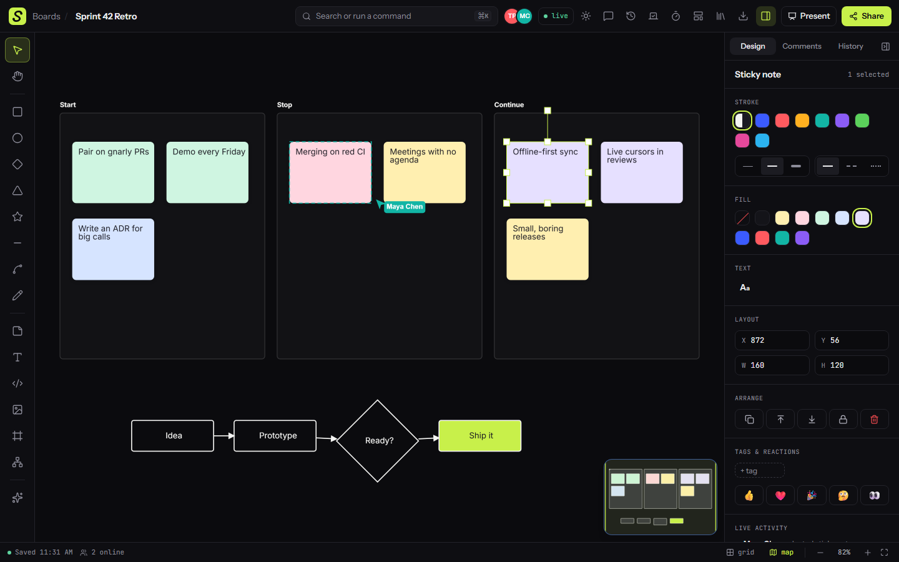
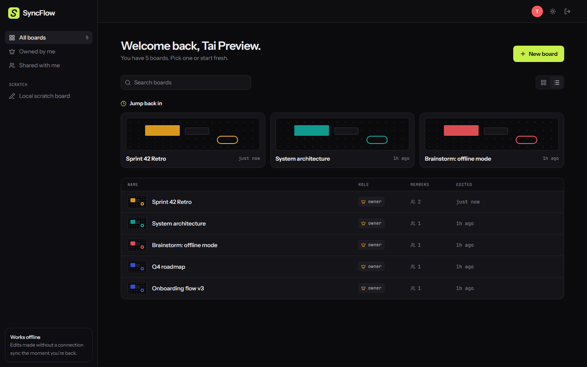
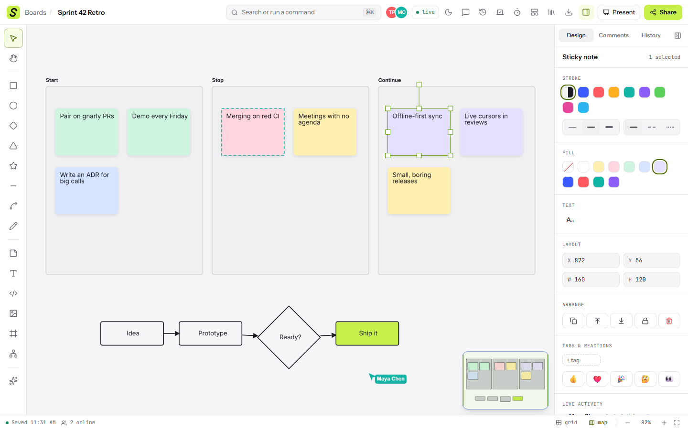
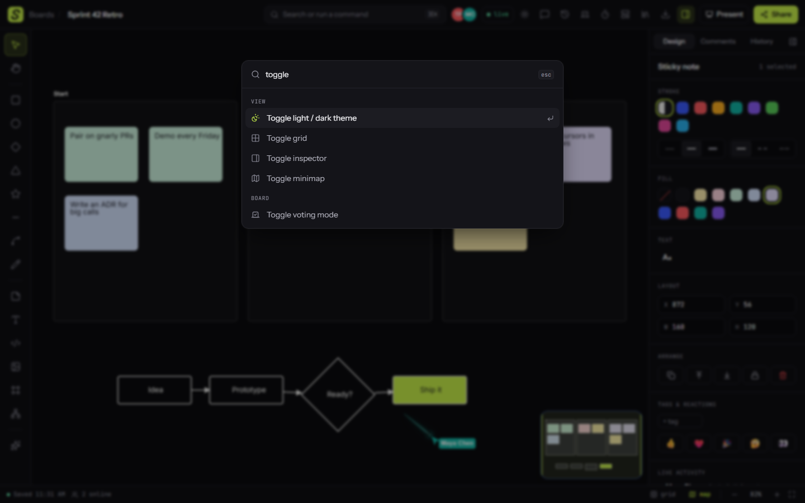
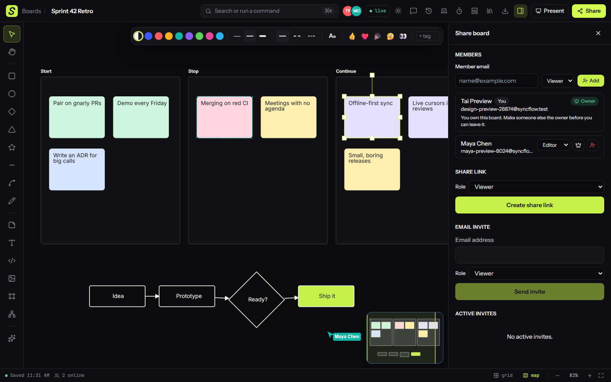
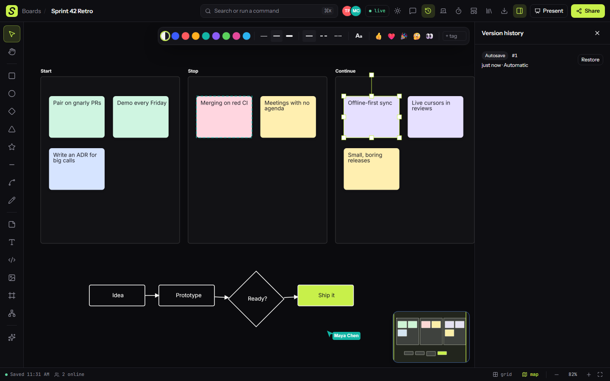
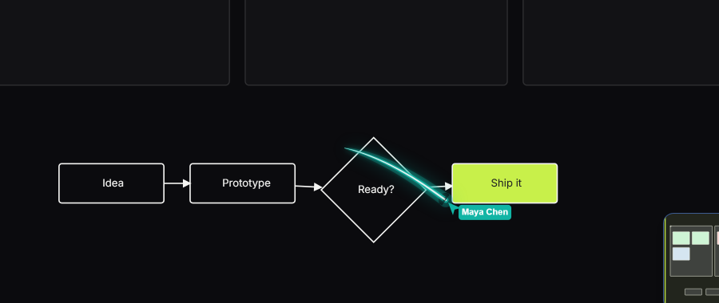
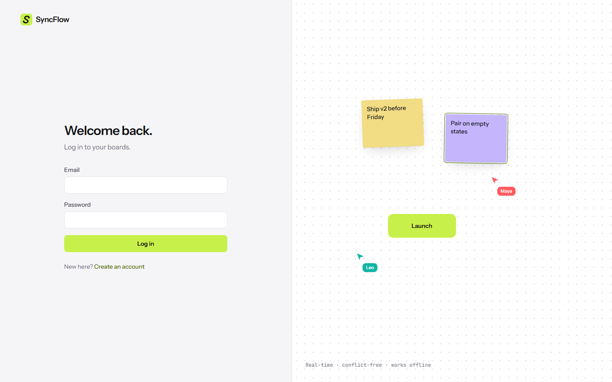
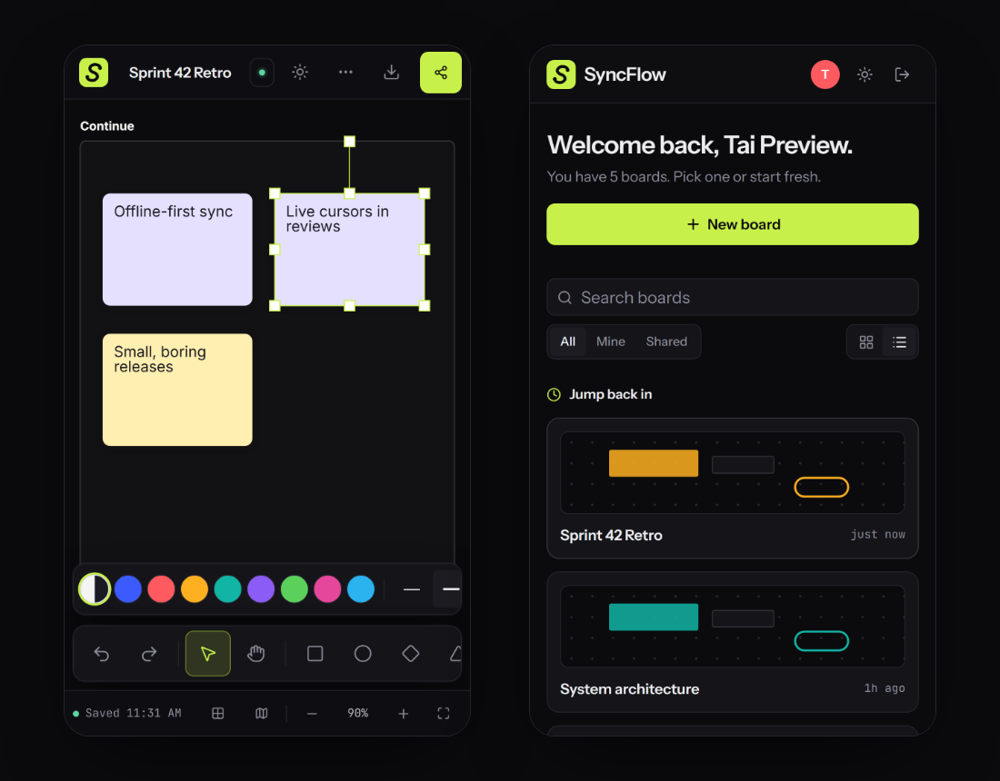
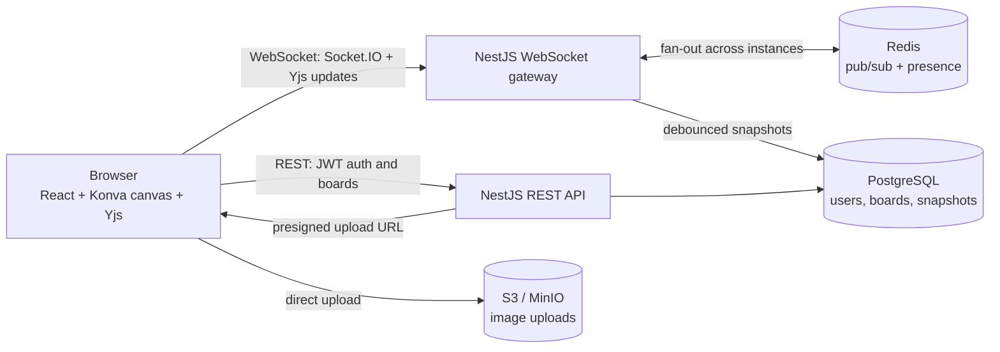

# SyncFlow

[](https://syncflows.xyz)
[](https://syncflows.xyz)
[](https://github.com/taizhixuan/SyncFlow/actions/workflows/ci.yml)
[](https://opensource.org/licenses/MIT)

SyncFlow is a multi-user, real-time collaborative whiteboard in the spirit of Miro and Excalidraw. A team shares one infinite canvas where you can draw shapes, add sticky notes, drop in images, and sketch freehand, and everyone sees each change as it happens. When two people edit at the same moment their changes merge automatically instead of overwriting one another, live presence shows who is working where, and your work survives dropped connections, tab reloads, and server restarts.

The interesting problem underneath is distributed real-time state: conflict-free concurrent editing, presence, offline reconciliation, and version history, all kept in sync across several server instances through Redis pub/sub.

## Tech stack

**Frontend**


**Backend**


**Infrastructure & deployment**


**Tooling & quality**


> `packages/shared` (TypeScript types and Zod schemas) is imported by both the client and the server, so every contract that crosses the network is defined exactly once.



## Screenshots

| | |
|---|---|
|  |  |
| **Landing page** | **Dashboard** |
|  |  |
| **Light theme** | **Command palette** (<kbd>Ctrl</kbd>/<kbd>⌘</kbd> + <kbd>K</kbd>) |
|  |  |
| **Sharing and members** | **Version history** |
|  |  |
| **Live laser pointer** | **Sign in** |



## What makes it different

The hard part is keeping everyone's canvas consistent. Picture two people dragging the same shape at the same instant. There are no server-side locks and no "last write wins" surprises, because the canvas is a CRDT built on Yjs: a data structure that merges concurrent changes correctly by design. The server stores periodic snapshots for durability and never invents state of its own.

## Features

### Real-time collaboration
- **Conflict-free sync (Yjs CRDT).** Concurrent edits merge instead of overwriting, including votes, reactions and comment replies made at the same moment.
- **Scales across servers.** Edits fan out between API instances over Redis pub/sub.
- **Presence and live cursors.** See where teammates point, what they select, and who is online.
- **Offline editing.** Changes are kept in IndexedDB and merge when you reconnect.
- **Collaboration-aware undo.** Undo your own actions without touching anyone else's.
- **Version history.** Rewind and restore a board without disrupting people editing live.
- **Live access changes.** Removing or demoting a member takes effect on their open connection immediately.

### Rich canvas
- Shapes, sticky notes, text, freehand, code blocks, images, and connectors that reroute as shapes move.
- Markdown in text boxes, link embeds, frames as sections or slides, and auto-laid-out mind maps.
- **Nested groups** with click-to-drill-in (<kbd>Ctrl</kbd>+<kbd>G</kbd> / <kbd>Ctrl</kbd>+<kbd>Shift</kbd>+<kbd>G</kbd>).
- Multi-select, snap to grid, copy and paste, alignment and distribution.
- **Read-only viewers** who still see every live edit.

### Built for teams
- **Comments** pinned to elements or points, with replies and a resolved state.
- **Voting** with dot votes or emoji reactions.
- **Tags** for labelling and filtering.
- **Shared timer** on the server's clock, so everyone counts down together.
- **Laser pointer** that leaves a fading trail in the presenter's colour.

### Workflows and exports
- **Templates** for retros, kanban, flowcharts, mind maps and user-story maps.
- **Component library** for reusable sets of objects.
- **Presentation mode** that turns frames into slides others can follow.
- **Exports** to PNG, SVG, PDF (whole board or one slide per frame) and Markdown outlines.

### Interface
- **"Midnight" design system** with full dark and light themes, built from CSS-variable tokens.
- **Docked editor**: tool rail, side panels beside the canvas, a status bar, minimap, and a hideable **inspector** for style, exact size and position, arranging, and live activity.
- **Command palette** (<kbd>Ctrl</kbd>/<kbd>⌘</kbd>+<kbd>K</kbd>) for every tool and action.
- **Dashboard** with search, filters, recent boards, and list or card layouts.
- **Works on phones**: bottom tool dock, long-press menus, and installable to the home screen.

### Platform essentials
- **Authentication** with short-lived JWTs and rotating refresh tokens; reusing a spent token revokes the session.
- **Board management**: create, duplicate and delete boards; manage members and roles; transfer ownership; invite by share link or single-use link.
- **Image uploads** straight to S3 (MinIO locally) through signed, board-scoped URLs.
- **Production hardening**: one JSON error format with request IDs, structured logs, security headers, and Redis-backed rate limits.

## Project structure

```
apps/
  web/              React + Vite client (organized by feature)
  api/              NestJS server (REST + WebSocket)
packages/
  shared/           Shared TypeScript types and Zod schemas
e2e/                Playwright browser tests (two-user collaboration flows)
docker/             Container configs and nginx setup
docker-compose.yml  Local dev stack: postgres, redis, minio
.github/workflows/  Automated testing, linting, building, and deployment
render.yaml         Deployment blueprint for Render hosting
```

`packages/shared` is the single source of truth. Any type or schema that crosses the network boundary lives there, so the client and server import the same definition and stay in step.

## Get started locally

You need Docker with Docker Compose, Node 20 or newer, and pnpm 9 or newer.

```bash
pnpm install
cp .env.example .env     # dev defaults work as-is
pnpm compose:up          # postgres, redis, minio
pnpm db:deploy           # apply the database schema
pnpm dev                 # web and API
```

Then open the app at http://localhost:5173 (API at http://localhost:3000/api/v1, MinIO console at http://localhost:9001). Postgres runs on port 5433 so it won't clash with a local install. To run the API and web in Docker as well, use `pnpm compose:full` (web on :8080).

### Configuration

The API validates its environment at startup and refuses to boot if anything is missing. Every variable is listed and explained in [`.env.example`](.env.example); the required ones are `DATABASE_URL`, `REDIS_URL`, `WEB_ORIGIN` and `JWT_ACCESS_SECRET` (at least 32 characters in production).

### Troubleshooting

- **API on the wrong port:** an inherited `PORT` variable (some launchers set one) overrides `API_PORT`. Start the API with `PORT` unset.

## Testing

```bash
pnpm test                               # unit tests (web, api, shared)
pnpm db:test:deploy                     # first time: set up the test database
pnpm test:e2e                           # API end-to-end, including real-time sync
pnpm exec playwright install chromium   # first time only
pnpm test:web-e2e                       # browser end-to-end
```

The end-to-end suites read only `.env.test`, never your dev `.env`; the CI workflow writes a complete example.

- **API e2e:** auth, boards, membership, invites, uploads and version history.
- **Real-time e2e:** concurrent edits converging through the real gateway, a two-server suite (cross-instance sync, Redis outages, live revocation), offline reconciliation, and saving on shutdown.
- **Browser e2e (Playwright):** two people editing one board, a read-only viewer, an offline edit reaching others, and the sign-up session. It runs on its own ports and database, so it can run alongside `pnpm dev`.

## Documentation

`pnpm run docs` builds all four into `docs/` (also built in CI). The REST docs are generated from the code, and the running API serves Swagger UI at `/api/v1/docs`.

```bash
pnpm run docs:reference    # TypeDoc         → shared schemas and types
pnpm run docs:rest         # OpenAPI + Redoc → REST API
pnpm run docs:structure    # Compodoc        → NestJS modules and providers
pnpm run docs:components   # Storybook       → React component catalog
```

## Deployment

**Live at [syncflows.xyz](https://syncflows.xyz).** Production runs across free tiers: the web app on Vercel, the API and Redis on Render (Docker), Postgres on Supabase, and image storage on AWS S3, with `api.syncflows.xyz` serving both REST and the WebSocket. Every push and pull request runs linting, type-checking, unit tests, a build, the API end-to-end suite, and the Playwright suite through GitHub Actions. The Render deploy hook fires only after all of them pass on `main`.

## How it works


```mermaid
flowchart LR
    Browser["Browser<br/>React + Konva canvas + Yjs"]
    GW["NestJS WebSocket gateway"]
    API["NestJS REST API"]
    Redis[("Redis<br/>pub/sub + presence")]
    PG[("PostgreSQL<br/>users, boards, snapshots")]
    S3[("S3 / MinIO<br/>image uploads")]

    Browser -->|"WebSocket: Socket.IO + Yjs updates"| GW
    Browser -->|"REST: JWT auth and boards"| API
    GW <-->|"fan-out across instances"| Redis
    GW -->|"debounced snapshots"| PG
    API --> PG
    API -->|"presigned upload URL"| Browser
    Browser -->|"direct upload"| S3
```

- **One Yjs document per board** lives in server memory, mirrored across instances through Redis. Postgres keeps snapshots saved a few seconds after editing stops, plus a version history that thins itself over time. Boards with unsaved edits are saved before a shutdown, and an instance that loses Redis catches up when it returns.
- **Presence** (cursors, selections, lasers) travels over Yjs Awareness: broadcast, never saved, and checked so nobody can publish a cursor under someone else's name.
- **Scaling out** means adding API servers; they share the same Redis channels, so every client sees every change. Images upload straight to S3 through signed URLs and never pass through the API.

## License

This project is licensed under the MIT License. See the [LICENSE](LICENSE) file for details.
